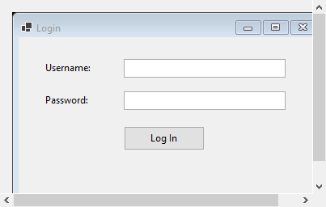
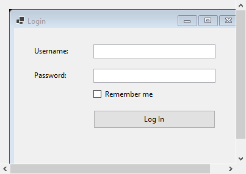
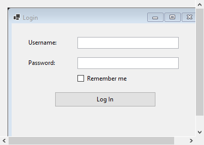
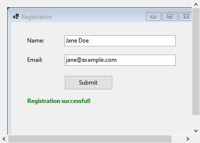
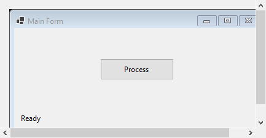
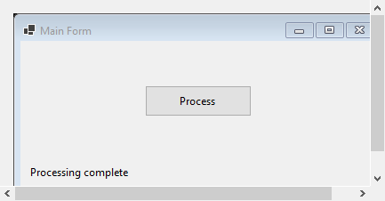

# Rhombus.WinFormsMcp -- Example Workflows

Real-world examples of using the WinForms MCP server through Claude Code conversations. These show what you say to Claude, and what Claude does behind the scenes using the MCP tools.

## Table of Contents

1. [Designing a Form from Scratch](#1-designing-a-form-from-scratch)
2. [Previewing an Existing Form](#2-previewing-an-existing-form)
3. [Iterating on Form Design](#3-iterating-on-form-design)
4. [Testing a Running App with FlaUI](#4-testing-a-running-app-with-flaui)
5. [Validating UI Changes](#5-validating-ui-changes)

---

## 1. Designing a Form from Scratch

You want Claude to create a login form. Claude writes the standard Visual Studio three-file convention, then previews it instantly without building.

```
> User: Create a login form with username, password, and a submit button.
>       Put it in src/MyApp/Forms/LoginForm.
```

Claude creates three files following Visual Studio conventions:

**LoginForm.cs** -- the code-behind with constructor and event handlers:

```csharp
namespace MyApp.Forms
{
    public partial class LoginForm : Form
    {
        public LoginForm()
        {
            InitializeComponent();
        }

        private void btnSubmit_Click(object sender, EventArgs e)
        {
            // TODO: authentication logic
        }
    }
}
```

**LoginForm.Designer.cs** -- all layout and control creation:

```csharp
namespace MyApp.Forms
{
    partial class LoginForm
    {
        private System.ComponentModel.IContainer components = null;

        protected override void Dispose(bool disposing)
        {
            if (disposing && (components != null))
                components.Dispose();
            base.Dispose(disposing);
        }

        private void InitializeComponent()
        {
            this.lblUsername = new System.Windows.Forms.Label();
            this.lblPassword = new System.Windows.Forms.Label();
            this.txtUsername = new System.Windows.Forms.TextBox();
            this.txtPassword = new System.Windows.Forms.TextBox();
            this.btnSubmit = new System.Windows.Forms.Button();
            this.SuspendLayout();
            //
            // lblUsername
            //
            this.lblUsername.AutoSize = true;
            this.lblUsername.Location = new System.Drawing.Point(30, 30);
            this.lblUsername.Name = "lblUsername";
            this.lblUsername.Size = new System.Drawing.Size(63, 15);
            this.lblUsername.Text = "Username:";
            //
            // txtUsername
            //
            this.txtUsername.Location = new System.Drawing.Point(130, 27);
            this.txtUsername.Name = "txtUsername";
            this.txtUsername.Size = new System.Drawing.Size(200, 23);
            //
            // lblPassword
            //
            this.lblPassword.AutoSize = true;
            this.lblPassword.Location = new System.Drawing.Point(30, 70);
            this.lblPassword.Name = "lblPassword";
            this.lblPassword.Size = new System.Drawing.Size(60, 15);
            this.lblPassword.Text = "Password:";
            //
            // txtPassword
            //
            this.txtPassword.Location = new System.Drawing.Point(130, 67);
            this.txtPassword.Name = "txtPassword";
            this.txtPassword.Size = new System.Drawing.Size(200, 23);
            //
            // btnSubmit
            //
            this.btnSubmit.Location = new System.Drawing.Point(130, 110);
            this.btnSubmit.Name = "btnSubmit";
            this.btnSubmit.Size = new System.Drawing.Size(100, 30);
            this.btnSubmit.Text = "Log In";
            this.btnSubmit.Click += new System.EventHandler(this.btnSubmit_Click);
            //
            // LoginForm
            //
            this.AutoScaleDimensions = new System.Drawing.SizeF(7F, 15F);
            this.AutoScaleMode = System.Windows.Forms.AutoScaleMode.Font;
            this.ClientSize = new System.Drawing.Size(370, 170);
            this.Controls.Add(this.btnSubmit);
            this.Controls.Add(this.txtPassword);
            this.Controls.Add(this.lblPassword);
            this.Controls.Add(this.txtUsername);
            this.Controls.Add(this.lblUsername);
            this.Name = "LoginForm";
            this.Text = "Login";
            this.ResumeLayout(false);
            this.PerformLayout();
        }

        private System.Windows.Forms.Label lblUsername;
        private System.Windows.Forms.Label lblPassword;
        private System.Windows.Forms.TextBox txtUsername;
        private System.Windows.Forms.TextBox txtPassword;
        private System.Windows.Forms.Button btnSubmit;
    }
}
```

Claude then previews the form immediately -- no build required:

```
Claude calls render_form:
  designerFilePath: "C:\project\src\MyApp\Forms\LoginForm.Designer.cs"
  outputPath: "C:\temp\login-preview.png"
```

Claude sees the rendered PNG and responds:

```
Here's the login form. It has a Username field, Password field, and a Log In
button. The layout is clean with left-aligned labels and consistent spacing.
Let me know if you want any changes.
```



---

## 2. Previewing an Existing Form

You point Claude at an existing form and ask for a preview. Claude picks the right renderer based on what controls the form uses.

### Standard controls only -- use `render_form`

```
> User: Show me what Forms/SettingsForm.Designer.cs looks like.
```

Claude reads the designer file and renders a preview:

```
Claude calls render_form:
  designerFilePath: "C:\project\Forms\SettingsForm.Designer.cs"

Completed in ~150ms (warm) / ~1s (cold start), returns base64 PNG
```

The `render_form` tool automatically detects the project's target framework from its `.csproj` and renders in a matching out-of-process host — no configuration needed. It handles standard controls, custom UserControls, and third-party controls alike.

---

## 3. Iterating on Form Design

The fast edit-render loop. You describe changes, Claude edits the designer file and re-renders until you're happy.

```
> User: Make the password field use a password mask.
```

Claude edits `LoginForm.Designer.cs`, adding one property:

```csharp
this.txtPassword.UseSystemPasswordChar = true;
```

```
Claude calls render_form:
  designerFilePath: "C:\project\src\MyApp\Forms\LoginForm.Designer.cs"
  outputPath: "C:\temp\login-preview-2.png"
```

```
Done. The password field now masks input with dots. Here's the updated preview.
```


```
> User: Add a "Remember me" checkbox below the password field, and make the
>       submit button wider.
```

Claude edits the designer file -- adds a `CheckBox` control, adjusts button width, shifts the button down to make room:

```
Claude calls render_form:
  designerFilePath: "C:\project\src\MyApp\Forms\LoginForm.Designer.cs"
  outputPath: "C:\temp\login-preview-3.png"
```

```
Added a "Remember me" checkbox at (130, 100) and widened the Log In button
to 200px. The button moved down to (130, 135) to make room for the checkbox.
The form height increased to 200 to fit everything. Here's the result.
```



```
> User: Looks good, but center the button horizontally.
```

Claude recalculates: form client width is 370, button width is 200, so `(370 - 200) / 2 = 85`. Edits the button's X position to 85.

```
Claude calls render_form:
  designerFilePath: "C:\project\src\MyApp\Forms\LoginForm.Designer.cs"
  outputPath: "C:\temp\login-preview-4.png"
```

```
Centered. The button is now at X=85 which puts it in the horizontal center
of the 370px-wide form.
```



This cycle takes seconds per iteration since `render_form` completes in ~150ms. No build step, no waiting.

---

## 4. Testing a Running App with FlaUI

You want Claude to launch an app, interact with it, and verify behavior -- all headless.

```
> User: Launch the test app and fill in the registration form. Use "Jane Doe"
>       for the name and "jane@example.com" for email, then submit it.
```

Claude launches the app:

```
Claude calls launch_app:
  path: "C:\project\bin\Debug\net8.0-windows\MyApp.exe"

Result: { success: true, pid: 8432, processName: "MyApp" }
```

Claude waits for the main window to load:

```
Claude calls wait_for_element:
  name: "Registration"
  timeoutMs: 5000

Result: { success: true, found: true }
```

Claude finds and fills the name field:

```
Claude calls find_element:
  automationId: "txtName"

Result: { success: true, elementId: "elem_1", controlType: "Edit" }

Claude calls type_text:
  elementId: "elem_1"
  text: "Jane Doe"
  clearFirst: true

Result: { success: true }
```

Claude finds and fills the email field:

```
Claude calls find_element:
  automationId: "txtEmail"

Result: { success: true, elementId: "elem_2", controlType: "Edit" }

Claude calls type_text:
  elementId: "elem_2"
  text: "jane@example.com"
  clearFirst: true

Result: { success: true }
```

Claude clicks the submit button:

```
Claude calls find_element:
  automationId: "btnSubmit"

Result: { success: true, elementId: "elem_3", controlType: "Button" }

Claude calls click_element:
  elementId: "elem_3"

Result: { success: true }
```

Claude takes a screenshot to show you the result:

```
Claude calls take_screenshot:
  outputPath: "C:\temp\registration-result.png"

Result: { success: true }
```

```
Done. I launched the app, filled in "Jane Doe" and "jane@example.com", and
clicked Submit. Here's a screenshot of the result -- the success message
is visible at the top of the form.
```



```
> User: Now close it.
```

```
Claude calls close_app:
  pid: 8432
  force: false

Result: { success: true }
```

```
App closed cleanly.
```

### Checking element properties

```
> User: Is the Submit button enabled after filling in both fields?
```

```
Claude calls get_property:
  elementId: "elem_3"
  propertyName: "isenabled"

Result: { success: true, value: "True" }
```

```
Yes, the Submit button is enabled.
```

### Keyboard shortcuts and navigation

```
> User: Test that Tab order works correctly on the form.
```

```
Claude calls click_element:
  elementId: "elem_1"    (clicks the name field to focus it)

Claude calls send_keys:
  keys: "{TAB}"          (Tab to next field)

Claude calls take_screenshot:
  outputPath: "C:\temp\tab-order-1.png"

Claude calls send_keys:
  keys: "{TAB}"          (Tab again)

Claude calls take_screenshot:
  outputPath: "C:\temp\tab-order-2.png"
```

```
Tab order is: Name field -> Email field -> Submit button. Each screenshot
shows the focus moving to the next control in sequence. The order matches
the expected flow.
```

---

## 5. Validating UI Changes

You made a code change and want to verify it looks right -- both as a static preview and at runtime.

```
> User: I just changed the main form to add a status bar. Can you verify it
>       looks right?
```

**Step 1: Static preview** -- Claude renders the designer file to check layout.

```
Claude calls render_form:
  designerFilePath: "C:\project\Forms\MainForm.Designer.cs"
  outputPath: "C:\temp\main-preview.png"
```

```
Static preview looks good. The status bar is docked to the bottom of the
form with the text "Ready" as expected. The other controls aren't overlapping
with it.
```



**Step 2: Runtime verification** -- Claude builds and launches to confirm it works.

```
> User: Good. Now run it and make sure the status bar updates when I click
>       the Process button.
```

Claude builds the project first, then launches:

```
Claude runs: dotnet build C:\project\MyApp.csproj

Claude calls launch_app:
  path: "C:\project\bin\Debug\net8.0-windows\MyApp.exe"

Result: { success: true, pid: 9210 }
```

Claude takes a "before" screenshot:

```
Claude calls take_screenshot:
  outputPath: "C:\temp\before-click.png"
```

Claude finds and reads the status bar text:

```
Claude calls find_element:
  automationId: "statusLabel"

Result: { success: true, elementId: "elem_1" }

Claude calls get_property:
  elementId: "elem_1"
  propertyName: "name"

Result: { value: "Ready" }
```

Claude clicks the Process button:

```
Claude calls find_element:
  automationId: "btnProcess"

Result: { success: true, elementId: "elem_2" }

Claude calls click_element:
  elementId: "elem_2"
```

Claude waits a moment, then checks the status bar again:

```
Claude calls wait_for_element:
  name: "Processing complete"
  timeoutMs: 5000

Result: { success: true, found: true }

Claude calls take_screenshot:
  outputPath: "C:\temp\after-click.png"
```

```
Verified. The status bar started at "Ready" and changed to "Processing
complete" after clicking the Process button. Here are the before and after
screenshots. Everything matches the expected behavior.

Before: status bar shows "Ready"
After: status bar shows "Processing complete"
```

| Before | After |
|--------|-------|
|  |  |

Claude cleans up:

```
Claude calls close_app:
  pid: 9210
```

---

## Tips

- **Use `render_form` for fast iteration** -- at ~150ms per render, you can tweak layouts interactively without waiting for builds.
- **Always use `wait_for_element` before interacting** -- apps take time to load, and elements may not be immediately available.
- **Use `clearFirst: true` when typing into fields** -- avoids appending to existing text.
- **Take screenshots to verify state** -- Claude can see the screenshots and tell you what's on screen.
- **Close apps when done** -- call `close_app` to clean up resources and avoid orphan processes.
- **Use `render_form` for instant previews** -- it works on any framework version and doesn't require the project to build.

---

For setup instructions, see [Claude Code Setup Guide](CLAUDE_CODE_SETUP.md). For the main project documentation, see the [README](../README.md).
